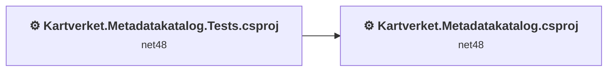
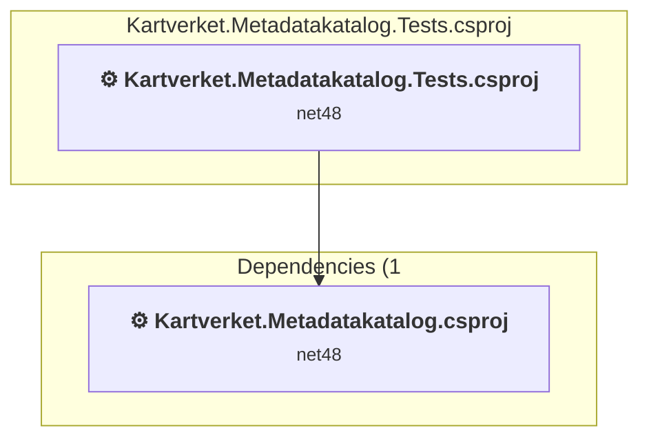
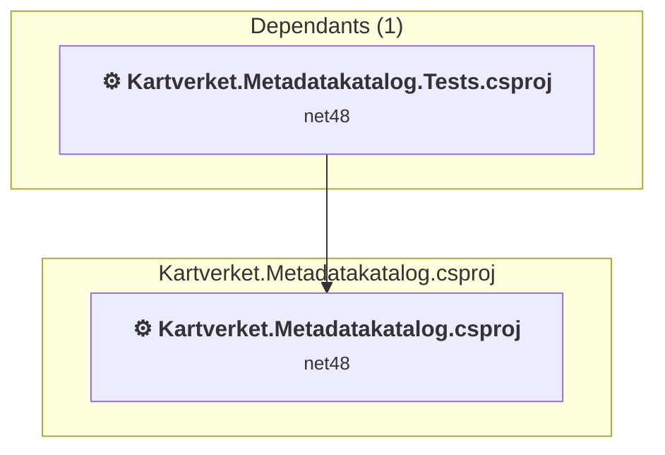

# Projects and dependencies analysis

This document provides a comprehensive overview of the projects and their dependencies in the context of upgrading to .NETCoreApp,Version=v10.0.

## Table of Contents

- [Executive Summary](#executive-Summary)
  - [Highlevel Metrics](#highlevel-metrics)
  - [Projects Compatibility](#projects-compatibility)
  - [Package Compatibility](#package-compatibility)
  - [API Compatibility](#api-compatibility)
- [Aggregate NuGet packages details](#aggregate-nuget-packages-details)
- [Top API Migration Challenges](#top-api-migration-challenges)
  - [Technologies and Features](#technologies-and-features)
  - [Most Frequent API Issues](#most-frequent-api-issues)
- [Projects Relationship Graph](#projects-relationship-graph)
- [Project Details](#project-details)

  - [Kartverket.Metadatakatalog.Tests\Kartverket.Metadatakatalog.Tests.csproj](#kartverketmetadatakatalogtestskartverketmetadatakatalogtestscsproj)
  - [Kartverket.Metadatakatalog\Kartverket.Metadatakatalog.csproj](#kartverketmetadatakatalogkartverketmetadatakatalogcsproj)

## Executive Summary

### Highlevel Metrics

| Metric | Count | Status |
| :--- | :---: | :--- |
| Total Projects | 2 | All require upgrade |
| Total NuGet Packages | 186 | 64 need upgrade |
| Total Code Files | 258 |  |
| Total Code Files with Incidents | 63 |  |
| Total Lines of Code | 29933 |  |
| Total Number of Issues | 1797 |  |
| Estimated LOC to modify | 1626+ | at least 5,4% of codebase |

### Projects Compatibility

| Project | Target Framework | Difficulty | Package Issues | API Issues | Est. LOC Impact | Description |
| :--- | :---: | :---: | :---: | :---: | :---: | :--- |
| [Kartverket.Metadatakatalog.Tests\Kartverket.Metadatakatalog.Tests.csproj](#kartverketmetadatakatalogtestskartverketmetadatakatalogtestscsproj) | net48 | 🟢 Low | 62 | 6 | 6+ | ClassicClassLibrary, Sdk Style = False |
| [Kartverket.Metadatakatalog\Kartverket.Metadatakatalog.csproj](#kartverketmetadatakatalogkartverketmetadatakatalogcsproj) | net48 | 🔴 High | 92 | 1620 | 1620+ | Wap, Sdk Style = False |

### Package Compatibility

| Status | Count | Percentage |
| :--- | :---: | :---: |
| ✅ Compatible | 122 | 65,6% |
| ⚠️ Incompatible | 24 | 12,9% |
| 🔄 Upgrade Recommended | 40 | 21,5% |
| ***Total NuGet Packages*** | ***186*** | ***100%*** |

### API Compatibility

| Category | Count | Impact |
| :--- | :---: | :--- |
| 🔴 Binary Incompatible | 1171 | High - Require code changes |
| 🟡 Source Incompatible | 392 | Medium - Needs re-compilation and potential conflicting API error fixing |
| 🔵 Behavioral change | 63 | Low - Behavioral changes that may require testing at runtime |
| ✅ Compatible | 22412 |  |
| ***Total APIs Analyzed*** | ***24038*** |  |

## Aggregate NuGet packages details

| Package | Current Version | Suggested Version | Projects | Description |
| :--- | :---: | :---: | :--- | :--- |
| Antlr | 3.5.0.2 |  | [Kartverket.Metadatakatalog.csproj](#kartverketmetadatakatalogkartverketmetadatakatalogcsproj) | Needs to be replaced with Replace with new package Antlr4=4.6.6 |
| Arkitektum.GIS.Lib.MetadataCSW | 2.0.0 |  | [Kartverket.Metadatakatalog.csproj](#kartverketmetadatakatalogkartverketmetadatakatalogcsproj) [Kartverket.Metadatakatalog.Tests.csproj](#kartverketmetadatakatalogtestskartverketmetadatakatalogtestscsproj) | ✅Compatible |
| Arkitektum.GIS.Lib.SerializeUtil | 1.4.0 |  | [Kartverket.Metadatakatalog.csproj](#kartverketmetadatakatalogkartverketmetadatakatalogcsproj) [Kartverket.Metadatakatalog.Tests.csproj](#kartverketmetadatakatalogtestskartverketmetadatakatalogtestscsproj) | ✅Compatible |
| Autofac | 4.9.4 |  | [Kartverket.Metadatakatalog.csproj](#kartverketmetadatakatalogkartverketmetadatakatalogcsproj) | ✅Compatible |
| Autofac.Mvc5 | 4.0.2 |  | [Kartverket.Metadatakatalog.csproj](#kartverketmetadatakatalogkartverketmetadatakatalogcsproj) | ⚠️NuGet package is incompatible |
| Autofac.Mvc5.Owin | 4.0.1 |  | [Kartverket.Metadatakatalog.csproj](#kartverketmetadatakatalogkartverketmetadatakatalogcsproj) | ⚠️NuGet package is incompatible |
| Autofac.Owin | 4.2.0 |  | [Kartverket.Metadatakatalog.csproj](#kartverketmetadatakatalogkartverketmetadatakatalogcsproj) | ⚠️NuGet package is incompatible |
| Autofac.WebApi2 | 4.3.1 |  | [Kartverket.Metadatakatalog.csproj](#kartverketmetadatakatalogkartverketmetadatakatalogcsproj) | ⚠️NuGet package is incompatible |
| Azure.Core | 1.42.0 |  | [Kartverket.Metadatakatalog.csproj](#kartverketmetadatakatalogkartverketmetadatakatalogcsproj) [Kartverket.Metadatakatalog.Tests.csproj](#kartverketmetadatakatalogtestskartverketmetadatakatalogtestscsproj) | ✅Compatible |
| Castle.Core | 4.4.0 |  | [Kartverket.Metadatakatalog.csproj](#kartverketmetadatakatalogkartverketmetadatakatalogcsproj) [Kartverket.Metadatakatalog.Tests.csproj](#kartverketmetadatakatalogtestskartverketmetadatakatalogtestscsproj) | ✅Compatible |
| Castle.Windsor | 5.0.1 |  | [Kartverket.Metadatakatalog.csproj](#kartverketmetadatakatalogkartverketmetadatakatalogcsproj) | ✅Compatible |
| CommonServiceLocator | 2.0.4 |  | [Kartverket.Metadatakatalog.csproj](#kartverketmetadatakatalogkartverketmetadatakatalogcsproj) | ✅Compatible |
| EntityFramework | 6.3.0 | 6.5.1 | [Kartverket.Metadatakatalog.csproj](#kartverketmetadatakatalogkartverketmetadatakatalogcsproj) | NuGet package upgrade is recommended |
| FluentAssertions | 5.9.0 |  | [Kartverket.Metadatakatalog.Tests.csproj](#kartverketmetadatakatalogtestskartverketmetadatakatalogtestscsproj) | ✅Compatible |
| Geonorge.AuthLib.Common | 1.0.67 |  | [Kartverket.Metadatakatalog.csproj](#kartverketmetadatakatalogkartverketmetadatakatalogcsproj) | ✅Compatible |
| Geonorge.AuthLib.NetFull | 1.0.67 |  | [Kartverket.Metadatakatalog.csproj](#kartverketmetadatakatalogkartverketmetadatakatalogcsproj) | ⚠️NuGet package is incompatible |
| GeoNorgeAPI | 4.0.3 |  | [Kartverket.Metadatakatalog.csproj](#kartverketmetadatakatalogkartverketmetadatakatalogcsproj) [Kartverket.Metadatakatalog.Tests.csproj](#kartverketmetadatakatalogtestskartverketmetadatakatalogtestscsproj) | ✅Compatible |
| Google.Api.CommonProtos | 2.16.0 |  | [Kartverket.Metadatakatalog.Tests.csproj](#kartverketmetadatakatalogtestskartverketmetadatakatalogtestscsproj) | ✅Compatible |
| Google.Api.Gax | 4.9.0 |  | [Kartverket.Metadatakatalog.Tests.csproj](#kartverketmetadatakatalogtestskartverketmetadatakatalogtestscsproj) | ✅Compatible |
| Google.Api.Gax.Grpc | 4.9.0 |  | [Kartverket.Metadatakatalog.Tests.csproj](#kartverketmetadatakatalogtestskartverketmetadatakatalogtestscsproj) | ✅Compatible |
| Google.Apis | 1.68.0 |  | [Kartverket.Metadatakatalog.csproj](#kartverketmetadatakatalogkartverketmetadatakatalogcsproj) [Kartverket.Metadatakatalog.Tests.csproj](#kartverketmetadatakatalogtestskartverketmetadatakatalogtestscsproj) | ✅Compatible |
| Google.Apis.Auth | 1.68.0 |  | [Kartverket.Metadatakatalog.csproj](#kartverketmetadatakatalogkartverketmetadatakatalogcsproj) [Kartverket.Metadatakatalog.Tests.csproj](#kartverketmetadatakatalogtestskartverketmetadatakatalogtestscsproj) | ✅Compatible |
| Google.Apis.Core | 1.68.0 |  | [Kartverket.Metadatakatalog.csproj](#kartverketmetadatakatalogkartverketmetadatakatalogcsproj) [Kartverket.Metadatakatalog.Tests.csproj](#kartverketmetadatakatalogtestskartverketmetadatakatalogtestscsproj) | ✅Compatible |
| Google.Cloud.Location | 2.3.0 |  | [Kartverket.Metadatakatalog.Tests.csproj](#kartverketmetadatakatalogtestskartverketmetadatakatalogtestscsproj) | ✅Compatible |
| Google.Protobuf | 3.28.2 |  | [Kartverket.Metadatakatalog.Tests.csproj](#kartverketmetadatakatalogtestskartverketmetadatakatalogtestscsproj) | ✅Compatible |
| Grpc.Auth | 2.66.0 |  | [Kartverket.Metadatakatalog.Tests.csproj](#kartverketmetadatakatalogtestskartverketmetadatakatalogtestscsproj) | ✅Compatible |
| Grpc.Core | 2.46.6 |  | [Kartverket.Metadatakatalog.Tests.csproj](#kartverketmetadatakatalogtestskartverketmetadatakatalogtestscsproj) | ✅Compatible |
| Grpc.Core.Api | 2.66.0 |  | [Kartverket.Metadatakatalog.Tests.csproj](#kartverketmetadatakatalogtestskartverketmetadatakatalogtestscsproj) | ✅Compatible |
| Grpc.Net.Client | 2.66.0 |  | [Kartverket.Metadatakatalog.Tests.csproj](#kartverketmetadatakatalogtestskartverketmetadatakatalogtestscsproj) | ✅Compatible |
| Grpc.Net.Common | 2.66.0 |  | [Kartverket.Metadatakatalog.Tests.csproj](#kartverketmetadatakatalogtestskartverketmetadatakatalogtestscsproj) | ✅Compatible |
| jQuery | 3.7.0 |  | [Kartverket.Metadatakatalog.csproj](#kartverketmetadatakatalogkartverketmetadatakatalogcsproj) | ✅Compatible |
| jQuery.Validation | 1.19.5 |  | [Kartverket.Metadatakatalog.csproj](#kartverketmetadatakatalogkartverketmetadatakatalogcsproj) | ✅Compatible |
| Kartverket.Geonorge.Utilities | 1.0.64 |  | [Kartverket.Metadatakatalog.csproj](#kartverketmetadatakatalogkartverketmetadatakatalogcsproj) [Kartverket.Metadatakatalog.Tests.csproj](#kartverketmetadatakatalogtestskartverketmetadatakatalogtestscsproj) | ✅Compatible |
| log4net | 2.0.12 |  | [Kartverket.Metadatakatalog.csproj](#kartverketmetadatakatalogkartverketmetadatakatalogcsproj) [Kartverket.Metadatakatalog.Tests.csproj](#kartverketmetadatakatalogtestskartverketmetadatakatalogtestscsproj) | ✅Compatible |
| Microsoft.AspNet.Cors | 5.2.7 |  | [Kartverket.Metadatakatalog.csproj](#kartverketmetadatakatalogkartverketmetadatakatalogcsproj) | NuGet package functionality is included with framework reference |
| Microsoft.AspNet.Mvc | 5.2.7 |  | [Kartverket.Metadatakatalog.csproj](#kartverketmetadatakatalogkartverketmetadatakatalogcsproj) [Kartverket.Metadatakatalog.Tests.csproj](#kartverketmetadatakatalogtestskartverketmetadatakatalogtestscsproj) | NuGet package functionality is included with framework reference |
| Microsoft.AspNet.Razor | 3.2.7 |  | [Kartverket.Metadatakatalog.csproj](#kartverketmetadatakatalogkartverketmetadatakatalogcsproj) [Kartverket.Metadatakatalog.Tests.csproj](#kartverketmetadatakatalogtestskartverketmetadatakatalogtestscsproj) | NuGet package functionality is included with framework reference |
| Microsoft.AspNet.Web.Optimization | 1.1.3 |  | [Kartverket.Metadatakatalog.csproj](#kartverketmetadatakatalogkartverketmetadatakatalogcsproj) | ⚠️NuGet package is incompatible |
| Microsoft.AspNet.WebApi | 5.2.7 |  | [Kartverket.Metadatakatalog.csproj](#kartverketmetadatakatalogkartverketmetadatakatalogcsproj) | NuGet package functionality is included with framework reference |
| Microsoft.AspNet.WebApi.Client | 6.0.0 |  | [Kartverket.Metadatakatalog.csproj](#kartverketmetadatakatalogkartverketmetadatakatalogcsproj) [Kartverket.Metadatakatalog.Tests.csproj](#kartverketmetadatakatalogtestskartverketmetadatakatalogtestscsproj) | ✅Compatible |
| Microsoft.AspNet.WebApi.Core | 5.2.7 |  | [Kartverket.Metadatakatalog.csproj](#kartverketmetadatakatalogkartverketmetadatakatalogcsproj) [Kartverket.Metadatakatalog.Tests.csproj](#kartverketmetadatakatalogtestskartverketmetadatakatalogtestscsproj) | ⚠️NuGet package is incompatible |
| Microsoft.AspNet.WebApi.Cors | 5.2.7 |  | [Kartverket.Metadatakatalog.csproj](#kartverketmetadatakatalogkartverketmetadatakatalogcsproj) | ⚠️NuGet package is incompatible |
| Microsoft.AspNet.WebApi.HelpPage | 5.2.7 |  | [Kartverket.Metadatakatalog.csproj](#kartverketmetadatakatalogkartverketmetadatakatalogcsproj) | ✅Compatible |
| Microsoft.AspNet.WebApi.WebHost | 5.2.7 |  | [Kartverket.Metadatakatalog.csproj](#kartverketmetadatakatalogkartverketmetadatakatalogcsproj) | ⚠️NuGet package is incompatible |
| Microsoft.AspNet.WebPages | 3.2.7 |  | [Kartverket.Metadatakatalog.csproj](#kartverketmetadatakatalogkartverketmetadatakatalogcsproj) [Kartverket.Metadatakatalog.Tests.csproj](#kartverketmetadatakatalogtestskartverketmetadatakatalogtestscsproj) | NuGet package functionality is included with framework reference |
| Microsoft.AspNetCore.Authentication | 2.3.0 |  | [Kartverket.Metadatakatalog.csproj](#kartverketmetadatakatalogkartverketmetadatakatalogcsproj) | NuGet package functionality is included with framework reference |
| Microsoft.AspNetCore.Authentication.Abstractions | 2.3.0 |  | [Kartverket.Metadatakatalog.csproj](#kartverketmetadatakatalogkartverketmetadatakatalogcsproj) | NuGet package functionality is included with framework reference |
| Microsoft.AspNetCore.Authentication.Core | 2.3.0 |  | [Kartverket.Metadatakatalog.csproj](#kartverketmetadatakatalogkartverketmetadatakatalogcsproj) | NuGet package functionality is included with framework reference |
| Microsoft.AspNetCore.Authentication.OAuth | 2.3.0 |  | [Kartverket.Metadatakatalog.csproj](#kartverketmetadatakatalogkartverketmetadatakatalogcsproj) | NuGet package functionality is included with framework reference |
| Microsoft.AspNetCore.Authentication.OpenIdConnect | 2.3.0 | 10.0.3 | [Kartverket.Metadatakatalog.csproj](#kartverketmetadatakatalogkartverketmetadatakatalogcsproj) | NuGet package upgrade is recommended |
| Microsoft.AspNetCore.Cryptography.Internal | 2.3.0 | 10.0.3 | [Kartverket.Metadatakatalog.csproj](#kartverketmetadatakatalogkartverketmetadatakatalogcsproj) | NuGet package upgrade is recommended |
| Microsoft.AspNetCore.DataProtection | 2.3.0 | 10.0.3 | [Kartverket.Metadatakatalog.csproj](#kartverketmetadatakatalogkartverketmetadatakatalogcsproj) | NuGet package upgrade is recommended |
| Microsoft.AspNetCore.DataProtection.Abstractions | 2.3.0 | 10.0.3 | [Kartverket.Metadatakatalog.csproj](#kartverketmetadatakatalogkartverketmetadatakatalogcsproj) | NuGet package upgrade is recommended |
| Microsoft.AspNetCore.Hosting.Abstractions | 2.3.0 |  | [Kartverket.Metadatakatalog.csproj](#kartverketmetadatakatalogkartverketmetadatakatalogcsproj) | NuGet package functionality is included with framework reference |
| Microsoft.AspNetCore.Hosting.Server.Abstractions | 2.3.0 |  | [Kartverket.Metadatakatalog.csproj](#kartverketmetadatakatalogkartverketmetadatakatalogcsproj) | NuGet package functionality is included with framework reference |
| Microsoft.AspNetCore.Http | 2.3.0 |  | [Kartverket.Metadatakatalog.csproj](#kartverketmetadatakatalogkartverketmetadatakatalogcsproj) | NuGet package functionality is included with framework reference |
| Microsoft.AspNetCore.Http.Abstractions | 2.3.0 |  | [Kartverket.Metadatakatalog.csproj](#kartverketmetadatakatalogkartverketmetadatakatalogcsproj) | NuGet package functionality is included with framework reference |
| Microsoft.AspNetCore.Http.Extensions | 2.3.0 |  | [Kartverket.Metadatakatalog.csproj](#kartverketmetadatakatalogkartverketmetadatakatalogcsproj) | NuGet package functionality is included with framework reference |
| Microsoft.AspNetCore.Http.Features | 2.3.0 |  | [Kartverket.Metadatakatalog.csproj](#kartverketmetadatakatalogkartverketmetadatakatalogcsproj) | NuGet package functionality is included with framework reference |
| Microsoft.AspNetCore.WebUtilities | 2.3.0 |  | [Kartverket.Metadatakatalog.csproj](#kartverketmetadatakatalogkartverketmetadatakatalogcsproj) | NuGet package functionality is included with framework reference |
| Microsoft.Bcl | 1.1.10 |  | [Kartverket.Metadatakatalog.csproj](#kartverketmetadatakatalogkartverketmetadatakatalogcsproj) [Kartverket.Metadatakatalog.Tests.csproj](#kartverketmetadatakatalogtestskartverketmetadatakatalogtestscsproj) | ⚠️NuGet package is incompatible |
| Microsoft.Bcl.Async | 1.0.168 |  | [Kartverket.Metadatakatalog.csproj](#kartverketmetadatakatalogkartverketmetadatakatalogcsproj) [Kartverket.Metadatakatalog.Tests.csproj](#kartverketmetadatakatalogtestskartverketmetadatakatalogtestscsproj) | ⚠️NuGet package is incompatible |
| Microsoft.Bcl.AsyncInterfaces | 6.0.0 | 10.0.3 | [Kartverket.Metadatakatalog.Tests.csproj](#kartverketmetadatakatalogtestskartverketmetadatakatalogtestscsproj) | NuGet package upgrade is recommended |
| Microsoft.Bcl.AsyncInterfaces | 8.0.0 | 10.0.3 | [Kartverket.Metadatakatalog.csproj](#kartverketmetadatakatalogkartverketmetadatakatalogcsproj) | NuGet package upgrade is recommended |
| Microsoft.Bcl.Build | 1.0.21 |  | [Kartverket.Metadatakatalog.csproj](#kartverketmetadatakatalogkartverketmetadatakatalogcsproj) [Kartverket.Metadatakatalog.Tests.csproj](#kartverketmetadatakatalogtestskartverketmetadatakatalogtestscsproj) | ✅Compatible |
| Microsoft.Bcl.TimeProvider | 8.0.1 | 10.0.3 | [Kartverket.Metadatakatalog.csproj](#kartverketmetadatakatalogkartverketmetadatakatalogcsproj) | NuGet package upgrade is recommended |
| Microsoft.CSharp | 4.7.0 |  | [Kartverket.Metadatakatalog.csproj](#kartverketmetadatakatalogkartverketmetadatakatalogcsproj) [Kartverket.Metadatakatalog.Tests.csproj](#kartverketmetadatakatalogtestskartverketmetadatakatalogtestscsproj) | ✅Compatible |
| Microsoft.Extensions.Configuration | 3.0.0 | 10.0.3 | [Kartverket.Metadatakatalog.csproj](#kartverketmetadatakatalogkartverketmetadatakatalogcsproj) | NuGet package upgrade is recommended |
| Microsoft.Extensions.Configuration.Abstractions | 8.0.0 | 10.0.3 | [Kartverket.Metadatakatalog.csproj](#kartverketmetadatakatalogkartverketmetadatakatalogcsproj) | NuGet package upgrade is recommended |
| Microsoft.Extensions.Configuration.Binder | 3.0.0 | 10.0.3 | [Kartverket.Metadatakatalog.csproj](#kartverketmetadatakatalogkartverketmetadatakatalogcsproj) | NuGet package upgrade is recommended |
| Microsoft.Extensions.DependencyInjection | 8.0.1 | 10.0.3 | [Kartverket.Metadatakatalog.csproj](#kartverketmetadatakatalogkartverketmetadatakatalogcsproj) | NuGet package upgrade is recommended |
| Microsoft.Extensions.DependencyInjection.Abstractions | 6.0.0 | 10.0.3 | [Kartverket.Metadatakatalog.Tests.csproj](#kartverketmetadatakatalogtestskartverketmetadatakatalogtestscsproj) | NuGet package upgrade is recommended |
| Microsoft.Extensions.DependencyInjection.Abstractions | 8.0.2 | 10.0.3 | [Kartverket.Metadatakatalog.csproj](#kartverketmetadatakatalogkartverketmetadatakatalogcsproj) | NuGet package upgrade is recommended |
| Microsoft.Extensions.Diagnostics.Abstractions | 8.0.1 | 10.0.3 | [Kartverket.Metadatakatalog.csproj](#kartverketmetadatakatalogkartverketmetadatakatalogcsproj) | NuGet package upgrade is recommended |
| Microsoft.Extensions.FileProviders.Abstractions | 8.0.0 | 10.0.3 | [Kartverket.Metadatakatalog.csproj](#kartverketmetadatakatalogkartverketmetadatakatalogcsproj) | NuGet package upgrade is recommended |
| Microsoft.Extensions.Hosting.Abstractions | 8.0.1 | 10.0.3 | [Kartverket.Metadatakatalog.csproj](#kartverketmetadatakatalogkartverketmetadatakatalogcsproj) | NuGet package upgrade is recommended |
| Microsoft.Extensions.Http | 8.0.1 | 10.0.3 | [Kartverket.Metadatakatalog.csproj](#kartverketmetadatakatalogkartverketmetadatakatalogcsproj) | NuGet package upgrade is recommended |
| Microsoft.Extensions.Logging | 8.0.1 | 10.0.3 | [Kartverket.Metadatakatalog.csproj](#kartverketmetadatakatalogkartverketmetadatakatalogcsproj) | NuGet package upgrade is recommended |
| Microsoft.Extensions.Logging.Abstractions | 6.0.0 | 10.0.3 | [Kartverket.Metadatakatalog.Tests.csproj](#kartverketmetadatakatalogtestskartverketmetadatakatalogtestscsproj) | NuGet package upgrade is recommended |
| Microsoft.Extensions.Logging.Abstractions | 8.0.2 | 10.0.3 | [Kartverket.Metadatakatalog.csproj](#kartverketmetadatakatalogkartverketmetadatakatalogcsproj) | NuGet package upgrade is recommended |
| Microsoft.Extensions.ObjectPool | 8.0.11 | 10.0.3 | [Kartverket.Metadatakatalog.csproj](#kartverketmetadatakatalogkartverketmetadatakatalogcsproj) | NuGet package upgrade is recommended |
| Microsoft.Extensions.Options | 8.0.2 | 10.0.3 | [Kartverket.Metadatakatalog.csproj](#kartverketmetadatakatalogkartverketmetadatakatalogcsproj) | NuGet package upgrade is recommended |
| Microsoft.Extensions.Primitives | 8.0.0 | 10.0.3 | [Kartverket.Metadatakatalog.csproj](#kartverketmetadatakatalogkartverketmetadatakatalogcsproj) | NuGet package upgrade is recommended |
| Microsoft.Extensions.WebEncoders | 8.0.11 | 10.0.3 | [Kartverket.Metadatakatalog.csproj](#kartverketmetadatakatalogkartverketmetadatakatalogcsproj) | NuGet package upgrade is recommended |
| Microsoft.IdentityModel.Abstractions | 8.14.0 |  | [Kartverket.Metadatakatalog.csproj](#kartverketmetadatakatalogkartverketmetadatakatalogcsproj) | ✅Compatible |
| Microsoft.IdentityModel.JsonWebTokens | 8.14.0 |  | [Kartverket.Metadatakatalog.csproj](#kartverketmetadatakatalogkartverketmetadatakatalogcsproj) | ✅Compatible |
| Microsoft.IdentityModel.Logging | 8.14.0 |  | [Kartverket.Metadatakatalog.csproj](#kartverketmetadatakatalogkartverketmetadatakatalogcsproj) | ✅Compatible |
| Microsoft.IdentityModel.Protocols | 8.14.0 |  | [Kartverket.Metadatakatalog.csproj](#kartverketmetadatakatalogkartverketmetadatakatalogcsproj) | ✅Compatible |
| Microsoft.IdentityModel.Protocols.OpenIdConnect | 8.14.0 |  | [Kartverket.Metadatakatalog.csproj](#kartverketmetadatakatalogkartverketmetadatakatalogcsproj) | ✅Compatible |
| Microsoft.IdentityModel.Tokens | 8.14.0 |  | [Kartverket.Metadatakatalog.csproj](#kartverketmetadatakatalogkartverketmetadatakatalogcsproj) | ✅Compatible |
| Microsoft.IdentityModel.Tokens.Saml | 5.2.4 |  | [Kartverket.Metadatakatalog.csproj](#kartverketmetadatakatalogkartverketmetadatakatalogcsproj) | ⚠️NuGet package is deprecated |
| Microsoft.IdentityModel.Xml | 5.2.4 |  | [Kartverket.Metadatakatalog.csproj](#kartverketmetadatakatalogkartverketmetadatakatalogcsproj) | ⚠️NuGet package is deprecated |
| Microsoft.jQuery.Unobtrusive.Validation | 3.2.11 |  | [Kartverket.Metadatakatalog.csproj](#kartverketmetadatakatalogkartverketmetadatakatalogcsproj) | ⚠️NuGet package is deprecated |
| Microsoft.Net.Http | 2.2.29 |  | [Kartverket.Metadatakatalog.csproj](#kartverketmetadatakatalogkartverketmetadatakatalogcsproj) [Kartverket.Metadatakatalog.Tests.csproj](#kartverketmetadatakatalogtestskartverketmetadatakatalogtestscsproj) | Needs to be replaced with Replace with new package System.Net.Http=4.3.4 |
| Microsoft.Net.Http.Headers | 2.3.0 |  | [Kartverket.Metadatakatalog.csproj](#kartverketmetadatakatalogkartverketmetadatakatalogcsproj) | NuGet package functionality is included with framework reference |
| Microsoft.NETCore.Platforms | 3.0.0 |  | [Kartverket.Metadatakatalog.Tests.csproj](#kartverketmetadatakatalogtestskartverketmetadatakatalogtestscsproj) | NuGet package functionality is included with framework reference |
| Microsoft.Owin | 4.2.3 |  | [Kartverket.Metadatakatalog.csproj](#kartverketmetadatakatalogkartverketmetadatakatalogcsproj) | ⚠️NuGet package is incompatible |
| Microsoft.Owin.Host.SystemWeb | 4.2.3 |  | [Kartverket.Metadatakatalog.csproj](#kartverketmetadatakatalogkartverketmetadatakatalogcsproj) | ⚠️NuGet package is incompatible |
| Microsoft.Owin.Security | 4.2.3 |  | [Kartverket.Metadatakatalog.csproj](#kartverketmetadatakatalogkartverketmetadatakatalogcsproj) | ⚠️NuGet package is incompatible |
| Microsoft.Owin.Security.Cookies | 4.2.3 |  | [Kartverket.Metadatakatalog.csproj](#kartverketmetadatakatalogkartverketmetadatakatalogcsproj) | ⚠️NuGet package is incompatible |
| Microsoft.Owin.Security.OpenIdConnect | 4.2.3 |  | [Kartverket.Metadatakatalog.csproj](#kartverketmetadatakatalogkartverketmetadatakatalogcsproj) | ⚠️NuGet package is incompatible |
| Microsoft.Web.Infrastructure | 1.0.0.0 |  | [Kartverket.Metadatakatalog.csproj](#kartverketmetadatakatalogkartverketmetadatakatalogcsproj) [Kartverket.Metadatakatalog.Tests.csproj](#kartverketmetadatakatalogtestskartverketmetadatakatalogtestscsproj) | NuGet package functionality is included with framework reference |
| Microsoft.Win32.Registry | 4.5.0 |  | [Kartverket.Metadatakatalog.csproj](#kartverketmetadatakatalogkartverketmetadatakatalogcsproj) | NuGet package functionality is included with framework reference |
| Moq | 4.13.0 |  | [Kartverket.Metadatakatalog.Tests.csproj](#kartverketmetadatakatalogtestskartverketmetadatakatalogtestscsproj) | ✅Compatible |
| NETStandard.Library | 2.0.3 |  | [Kartverket.Metadatakatalog.Tests.csproj](#kartverketmetadatakatalogtestskartverketmetadatakatalogtestscsproj) | NuGet package functionality is included with framework reference |
| Newtonsoft.Json | 13.0.4 |  | [Kartverket.Metadatakatalog.csproj](#kartverketmetadatakatalogkartverketmetadatakatalogcsproj) [Kartverket.Metadatakatalog.Tests.csproj](#kartverketmetadatakatalogtestskartverketmetadatakatalogtestscsproj) | ✅Compatible |
| Newtonsoft.Json.Bson | 1.0.2 |  | [Kartverket.Metadatakatalog.csproj](#kartverketmetadatakatalogkartverketmetadatakatalogcsproj) [Kartverket.Metadatakatalog.Tests.csproj](#kartverketmetadatakatalogtestskartverketmetadatakatalogtestscsproj) | ✅Compatible |
| OctoPack | 3.6.4 |  | [Kartverket.Metadatakatalog.csproj](#kartverketmetadatakatalogkartverketmetadatakatalogcsproj) | ✅Compatible |
| OpenAI | 2.0.0-beta.11 |  | [Kartverket.Metadatakatalog.csproj](#kartverketmetadatakatalogkartverketmetadatakatalogcsproj) [Kartverket.Metadatakatalog.Tests.csproj](#kartverketmetadatakatalogtestskartverketmetadatakatalogtestscsproj) | ✅Compatible |
| Owin | 1.0 |  | [Kartverket.Metadatakatalog.csproj](#kartverketmetadatakatalogkartverketmetadatakatalogcsproj) | ⚠️NuGet package is incompatible |
| PCLStorage | 1.0.2 |  | [Kartverket.Metadatakatalog.csproj](#kartverketmetadatakatalogkartverketmetadatakatalogcsproj) [Kartverket.Metadatakatalog.Tests.csproj](#kartverketmetadatakatalogtestskartverketmetadatakatalogtestscsproj) | ⚠️NuGet package is incompatible |
| Respond | 1.4.2 |  | [Kartverket.Metadatakatalog.csproj](#kartverketmetadatakatalogkartverketmetadatakatalogcsproj) | ✅Compatible |
| SolrNet | 1.0.19 |  | [Kartverket.Metadatakatalog.csproj](#kartverketmetadatakatalogkartverketmetadatakatalogcsproj) | ✅Compatible |
| SolrNet.Core | 1.0.19 |  | [Kartverket.Metadatakatalog.csproj](#kartverketmetadatakatalogkartverketmetadatakatalogcsproj) | ✅Compatible |
| SolrNet.Windsor | 1.0.19 |  | [Kartverket.Metadatakatalog.csproj](#kartverketmetadatakatalogkartverketmetadatakatalogcsproj) | ✅Compatible |
| Swashbuckle | 5.6.0 |  | [Kartverket.Metadatakatalog.csproj](#kartverketmetadatakatalogkartverketmetadatakatalogcsproj) | ✅Compatible |
| Swashbuckle.Core | 5.6.0 |  | [Kartverket.Metadatakatalog.csproj](#kartverketmetadatakatalogkartverketmetadatakatalogcsproj) | ⚠️NuGet package is incompatible |
| System.Buffers | 4.5.1 |  | [Kartverket.Metadatakatalog.Tests.csproj](#kartverketmetadatakatalogtestskartverketmetadatakatalogtestscsproj) | NuGet package functionality is included with framework reference |
| System.Buffers | 4.6.0 |  | [Kartverket.Metadatakatalog.csproj](#kartverketmetadatakatalogkartverketmetadatakatalogcsproj) | NuGet package functionality is included with framework reference |
| System.ClientModel | 1.1.0-beta.5 |  | [Kartverket.Metadatakatalog.csproj](#kartverketmetadatakatalogkartverketmetadatakatalogcsproj) [Kartverket.Metadatakatalog.Tests.csproj](#kartverketmetadatakatalogtestskartverketmetadatakatalogtestscsproj) | ✅Compatible |
| System.CodeDom | 7.0.0 | 10.0.3 | [Kartverket.Metadatakatalog.csproj](#kartverketmetadatakatalogkartverketmetadatakatalogcsproj) [Kartverket.Metadatakatalog.Tests.csproj](#kartverketmetadatakatalogtestskartverketmetadatakatalogtestscsproj) | NuGet package upgrade is recommended |
| System.Collections | 4.3.0 |  | [Kartverket.Metadatakatalog.Tests.csproj](#kartverketmetadatakatalogtestskartverketmetadatakatalogtestscsproj) | NuGet package functionality is included with framework reference |
| System.Collections.Concurrent | 4.3.0 |  | [Kartverket.Metadatakatalog.Tests.csproj](#kartverketmetadatakatalogtestskartverketmetadatakatalogtestscsproj) | NuGet package functionality is included with framework reference |
| System.ComponentModel.Annotations | 4.6.0 |  | [Kartverket.Metadatakatalog.csproj](#kartverketmetadatakatalogkartverketmetadatakatalogcsproj) | NuGet package functionality is included with framework reference |
| System.Configuration.ConfigurationManager | 4.7.0 | 10.0.3 | [Kartverket.Metadatakatalog.csproj](#kartverketmetadatakatalogkartverketmetadatakatalogcsproj) | NuGet package upgrade is recommended |
| System.Diagnostics.Debug | 4.3.0 |  | [Kartverket.Metadatakatalog.Tests.csproj](#kartverketmetadatakatalogtestskartverketmetadatakatalogtestscsproj) | NuGet package functionality is included with framework reference |
| System.Diagnostics.DiagnosticSource | 6.0.1 | 10.0.3 | [Kartverket.Metadatakatalog.Tests.csproj](#kartverketmetadatakatalogtestskartverketmetadatakatalogtestscsproj) | NuGet package upgrade is recommended |
| System.Diagnostics.DiagnosticSource | 8.0.1 | 10.0.3 | [Kartverket.Metadatakatalog.csproj](#kartverketmetadatakatalogkartverketmetadatakatalogcsproj) | NuGet package upgrade is recommended |
| System.Diagnostics.Tools | 4.3.0 |  | [Kartverket.Metadatakatalog.Tests.csproj](#kartverketmetadatakatalogtestskartverketmetadatakatalogtestscsproj) | NuGet package functionality is included with framework reference |
| System.Diagnostics.Tracing | 4.3.0 |  | [Kartverket.Metadatakatalog.Tests.csproj](#kartverketmetadatakatalogtestskartverketmetadatakatalogtestscsproj) | NuGet package functionality is included with framework reference |
| System.Globalization | 4.3.0 |  | [Kartverket.Metadatakatalog.Tests.csproj](#kartverketmetadatakatalogtestskartverketmetadatakatalogtestscsproj) | NuGet package functionality is included with framework reference |
| System.IdentityModel.Tokens.Jwt | 8.14.0 |  | [Kartverket.Metadatakatalog.csproj](#kartverketmetadatakatalogkartverketmetadatakatalogcsproj) | ✅Compatible |
| System.IO | 4.3.0 |  | [Kartverket.Metadatakatalog.Tests.csproj](#kartverketmetadatakatalogtestskartverketmetadatakatalogtestscsproj) | NuGet package functionality is included with framework reference |
| System.IO.Compression | 4.3.0 |  | [Kartverket.Metadatakatalog.Tests.csproj](#kartverketmetadatakatalogtestskartverketmetadatakatalogtestscsproj) | NuGet package functionality is included with framework reference |
| System.Linq | 4.3.0 |  | [Kartverket.Metadatakatalog.Tests.csproj](#kartverketmetadatakatalogtestskartverketmetadatakatalogtestscsproj) | NuGet package functionality is included with framework reference |
| System.Linq.Expressions | 4.3.0 |  | [Kartverket.Metadatakatalog.Tests.csproj](#kartverketmetadatakatalogtestskartverketmetadatakatalogtestscsproj) | NuGet package functionality is included with framework reference |
| System.Management | 7.0.2 | 10.0.3 | [Kartverket.Metadatakatalog.csproj](#kartverketmetadatakatalogkartverketmetadatakatalogcsproj) [Kartverket.Metadatakatalog.Tests.csproj](#kartverketmetadatakatalogtestskartverketmetadatakatalogtestscsproj) | NuGet package upgrade is recommended |
| System.Memory | 4.5.5 |  | [Kartverket.Metadatakatalog.csproj](#kartverketmetadatakatalogkartverketmetadatakatalogcsproj) [Kartverket.Metadatakatalog.Tests.csproj](#kartverketmetadatakatalogtestskartverketmetadatakatalogtestscsproj) | NuGet package functionality is included with framework reference |
| System.Memory.Data | 1.0.2 | 10.0.3 | [Kartverket.Metadatakatalog.csproj](#kartverketmetadatakatalogkartverketmetadatakatalogcsproj) [Kartverket.Metadatakatalog.Tests.csproj](#kartverketmetadatakatalogtestskartverketmetadatakatalogtestscsproj) | NuGet package upgrade is recommended |
| System.Net.Http | 4.3.4 |  | [Kartverket.Metadatakatalog.Tests.csproj](#kartverketmetadatakatalogtestskartverketmetadatakatalogtestscsproj) | NuGet package functionality is included with framework reference |
| System.Net.Http.WinHttpHandler | 8.0.0 | 10.0.3 | [Kartverket.Metadatakatalog.csproj](#kartverketmetadatakatalogkartverketmetadatakatalogcsproj) [Kartverket.Metadatakatalog.Tests.csproj](#kartverketmetadatakatalogtestskartverketmetadatakatalogtestscsproj) | NuGet package upgrade is recommended |
| System.Net.Primitives | 4.3.1 |  | [Kartverket.Metadatakatalog.Tests.csproj](#kartverketmetadatakatalogtestskartverketmetadatakatalogtestscsproj) | NuGet package functionality is included with framework reference |
| System.Numerics.Vectors | 4.5.0 |  | [Kartverket.Metadatakatalog.csproj](#kartverketmetadatakatalogkartverketmetadatakatalogcsproj) [Kartverket.Metadatakatalog.Tests.csproj](#kartverketmetadatakatalogtestskartverketmetadatakatalogtestscsproj) | NuGet package functionality is included with framework reference |
| System.ObjectModel | 4.3.0 |  | [Kartverket.Metadatakatalog.Tests.csproj](#kartverketmetadatakatalogtestskartverketmetadatakatalogtestscsproj) | NuGet package functionality is included with framework reference |
| System.Reflection | 4.3.0 |  | [Kartverket.Metadatakatalog.Tests.csproj](#kartverketmetadatakatalogtestskartverketmetadatakatalogtestscsproj) | NuGet package functionality is included with framework reference |
| System.Reflection.Extensions | 4.3.0 |  | [Kartverket.Metadatakatalog.Tests.csproj](#kartverketmetadatakatalogtestskartverketmetadatakatalogtestscsproj) | NuGet package functionality is included with framework reference |
| System.Reflection.Primitives | 4.3.0 |  | [Kartverket.Metadatakatalog.Tests.csproj](#kartverketmetadatakatalogtestskartverketmetadatakatalogtestscsproj) | NuGet package functionality is included with framework reference |
| System.Resources.ResourceManager | 4.3.0 |  | [Kartverket.Metadatakatalog.Tests.csproj](#kartverketmetadatakatalogtestskartverketmetadatakatalogtestscsproj) | NuGet package functionality is included with framework reference |
| System.Runtime | 4.3.1 |  | [Kartverket.Metadatakatalog.Tests.csproj](#kartverketmetadatakatalogtestskartverketmetadatakatalogtestscsproj) | NuGet package functionality is included with framework reference |
| System.Runtime.CompilerServices.Unsafe | 6.0.0 | 6.1.2 | [Kartverket.Metadatakatalog.csproj](#kartverketmetadatakatalogkartverketmetadatakatalogcsproj) [Kartverket.Metadatakatalog.Tests.csproj](#kartverketmetadatakatalogtestskartverketmetadatakatalogtestscsproj) | NuGet package upgrade is recommended |
| System.Runtime.Extensions | 4.3.1 |  | [Kartverket.Metadatakatalog.Tests.csproj](#kartverketmetadatakatalogtestskartverketmetadatakatalogtestscsproj) | NuGet package functionality is included with framework reference |
| System.Runtime.InteropServices | 4.3.0 |  | [Kartverket.Metadatakatalog.Tests.csproj](#kartverketmetadatakatalogtestskartverketmetadatakatalogtestscsproj) | NuGet package functionality is included with framework reference |
| System.Runtime.InteropServices.RuntimeInformation | 4.3.0 |  | [Kartverket.Metadatakatalog.Tests.csproj](#kartverketmetadatakatalogtestskartverketmetadatakatalogtestscsproj) | NuGet package functionality is included with framework reference |
| System.Runtime.Numerics | 4.3.0 |  | [Kartverket.Metadatakatalog.Tests.csproj](#kartverketmetadatakatalogtestskartverketmetadatakatalogtestscsproj) | NuGet package functionality is included with framework reference |
| System.Security.AccessControl | 4.7.0 | 6.0.1 | [Kartverket.Metadatakatalog.csproj](#kartverketmetadatakatalogkartverketmetadatakatalogcsproj) | NuGet package upgrade is recommended |
| System.Security.Cryptography.Algorithms | 4.3.1 |  | [Kartverket.Metadatakatalog.Tests.csproj](#kartverketmetadatakatalogtestskartverketmetadatakatalogtestscsproj) | NuGet package functionality is included with framework reference |
| System.Security.Cryptography.Encoding | 4.3.0 |  | [Kartverket.Metadatakatalog.Tests.csproj](#kartverketmetadatakatalogtestskartverketmetadatakatalogtestscsproj) | NuGet package functionality is included with framework reference |
| System.Security.Cryptography.Primitives | 4.3.0 |  | [Kartverket.Metadatakatalog.Tests.csproj](#kartverketmetadatakatalogtestskartverketmetadatakatalogtestscsproj) | NuGet package functionality is included with framework reference |
| System.Security.Cryptography.X509Certificates | 4.3.2 |  | [Kartverket.Metadatakatalog.Tests.csproj](#kartverketmetadatakatalogtestskartverketmetadatakatalogtestscsproj) | NuGet package functionality is included with framework reference |
| System.Security.Cryptography.Xml | 8.0.2 | 10.0.3 | [Kartverket.Metadatakatalog.csproj](#kartverketmetadatakatalogkartverketmetadatakatalogcsproj) | NuGet package upgrade is recommended |
| System.Security.Permissions | 4.7.0 | 10.0.3 | [Kartverket.Metadatakatalog.csproj](#kartverketmetadatakatalogkartverketmetadatakatalogcsproj) | NuGet package upgrade is recommended |
| System.Security.Principal.Windows | 5.0.0 |  | [Kartverket.Metadatakatalog.csproj](#kartverketmetadatakatalogkartverketmetadatakatalogcsproj) | NuGet package functionality is included with framework reference |
| System.Text.Encoding | 4.3.0 |  | [Kartverket.Metadatakatalog.Tests.csproj](#kartverketmetadatakatalogtestskartverketmetadatakatalogtestscsproj) | NuGet package functionality is included with framework reference |
| System.Text.Encoding.Extensions | 4.3.0 |  | [Kartverket.Metadatakatalog.Tests.csproj](#kartverketmetadatakatalogtestskartverketmetadatakatalogtestscsproj) | NuGet package functionality is included with framework reference |
| System.Text.Encodings.Web | 6.0.0 | 10.0.3 | [Kartverket.Metadatakatalog.Tests.csproj](#kartverketmetadatakatalogtestskartverketmetadatakatalogtestscsproj) | NuGet package upgrade is recommended |
| System.Text.Encodings.Web | 8.0.0 | 10.0.3 | [Kartverket.Metadatakatalog.csproj](#kartverketmetadatakatalogkartverketmetadatakatalogcsproj) | NuGet package upgrade is recommended |
| System.Text.Json | 4.7.2 | 10.0.3 | [Kartverket.Metadatakatalog.Tests.csproj](#kartverketmetadatakatalogtestskartverketmetadatakatalogtestscsproj) | NuGet package upgrade is recommended |
| System.Text.Json | 8.0.5 | 10.0.3 | [Kartverket.Metadatakatalog.csproj](#kartverketmetadatakatalogkartverketmetadatakatalogcsproj) | NuGet package upgrade is recommended |
| System.Text.RegularExpressions | 4.3.1 |  | [Kartverket.Metadatakatalog.Tests.csproj](#kartverketmetadatakatalogtestskartverketmetadatakatalogtestscsproj) | NuGet package functionality is included with framework reference |
| System.Threading | 4.3.0 |  | [Kartverket.Metadatakatalog.Tests.csproj](#kartverketmetadatakatalogtestskartverketmetadatakatalogtestscsproj) | NuGet package functionality is included with framework reference |
| System.Threading.Tasks | 4.3.0 |  | [Kartverket.Metadatakatalog.Tests.csproj](#kartverketmetadatakatalogtestskartverketmetadatakatalogtestscsproj) | NuGet package functionality is included with framework reference |
| System.Threading.Tasks.Extensions | 4.5.4 |  | [Kartverket.Metadatakatalog.csproj](#kartverketmetadatakatalogkartverketmetadatakatalogcsproj) [Kartverket.Metadatakatalog.Tests.csproj](#kartverketmetadatakatalogtestskartverketmetadatakatalogtestscsproj) | NuGet package functionality is included with framework reference |
| System.ValueTuple | 4.5.0 |  | [Kartverket.Metadatakatalog.csproj](#kartverketmetadatakatalogkartverketmetadatakatalogcsproj) [Kartverket.Metadatakatalog.Tests.csproj](#kartverketmetadatakatalogtestskartverketmetadatakatalogtestscsproj) | NuGet package functionality is included with framework reference |
| System.Xml.ReaderWriter | 4.3.1 |  | [Kartverket.Metadatakatalog.Tests.csproj](#kartverketmetadatakatalogtestskartverketmetadatakatalogtestscsproj) | NuGet package functionality is included with framework reference |
| System.Xml.XDocument | 4.3.0 |  | [Kartverket.Metadatakatalog.Tests.csproj](#kartverketmetadatakatalogtestskartverketmetadatakatalogtestscsproj) | NuGet package functionality is included with framework reference |
| WebActivatorEx | 2.0 |  | [Kartverket.Metadatakatalog.csproj](#kartverketmetadatakatalogkartverketmetadatakatalogcsproj) | ⚠️NuGet package is incompatible |
| WebApi.BasicAuth | 0.3.0 |  | [Kartverket.Metadatakatalog.csproj](#kartverketmetadatakatalogkartverketmetadatakatalogcsproj) | ⚠️NuGet package is incompatible |
| WebGrease | 1.6.0 |  | [Kartverket.Metadatakatalog.csproj](#kartverketmetadatakatalogkartverketmetadatakatalogcsproj) | ✅Compatible |
| xunit | 2.4.1 |  | [Kartverket.Metadatakatalog.Tests.csproj](#kartverketmetadatakatalogtestskartverketmetadatakatalogtestscsproj) | ✅Compatible |
| xunit.abstractions | 2.0.3 |  | [Kartverket.Metadatakatalog.Tests.csproj](#kartverketmetadatakatalogtestskartverketmetadatakatalogtestscsproj) | ✅Compatible |
| xunit.analyzers | 0.10.0 |  | [Kartverket.Metadatakatalog.Tests.csproj](#kartverketmetadatakatalogtestskartverketmetadatakatalogtestscsproj) | ✅Compatible |
| xunit.assert | 2.4.1 |  | [Kartverket.Metadatakatalog.Tests.csproj](#kartverketmetadatakatalogtestskartverketmetadatakatalogtestscsproj) | ✅Compatible |
| xunit.core | 2.4.1 |  | [Kartverket.Metadatakatalog.Tests.csproj](#kartverketmetadatakatalogtestskartverketmetadatakatalogtestscsproj) | ✅Compatible |
| xunit.extensibility.core | 2.4.1 |  | [Kartverket.Metadatakatalog.Tests.csproj](#kartverketmetadatakatalogtestskartverketmetadatakatalogtestscsproj) | ✅Compatible |
| xunit.extensibility.execution | 2.4.1 |  | [Kartverket.Metadatakatalog.Tests.csproj](#kartverketmetadatakatalogtestskartverketmetadatakatalogtestscsproj) | ✅Compatible |
| xunit.runner.visualstudio | 2.4.1 |  | [Kartverket.Metadatakatalog.Tests.csproj](#kartverketmetadatakatalogtestskartverketmetadatakatalogtestscsproj) | ✅Compatible |

## Top API Migration Challenges

### Technologies and Features

| Technology | Issues | Percentage | Migration Path |
| :--- | :---: | :---: | :--- |
| ASP.NET Framework (System.Web) | 1429 | 87,9% | Legacy ASP.NET Framework APIs for web applications (System.Web.*) that don't exist in ASP.NET Core due to architectural differences. ASP.NET Core represents a complete redesign of the web framework. Migrate to ASP.NET Core equivalents or consider System.Web.Adapters package for compatibility. |
| Legacy Configuration System | 8 | 0,5% | Legacy XML-based configuration system (app.config/web.config) that has been replaced by a more flexible configuration model in .NET Core. The old system was rigid and XML-based. Migrate to Microsoft.Extensions.Configuration with JSON/environment variables; use System.Configuration.ConfigurationManager NuGet package as interim bridge if needed. |

### Most Frequent API Issues

| API | Count | Percentage | Category |
| :--- | :---: | :---: | :--- |
| T:System.Web.Routing.RouteValueDictionary | 82 | 5,0% | Binary Incompatible |
| T:System.Web.Configuration.WebConfigurationManager | 59 | 3,6% | Binary Incompatible |
| P:System.Web.Configuration.WebConfigurationManager.AppSettings | 59 | 3,6% | Binary Incompatible |
| P:System.Web.Routing.RouteValueDictionary.Item(System.String) | 42 | 2,6% | Binary Incompatible |
| T:System.Web.Http.HttpConfiguration | 41 | 2,5% | Binary Incompatible |
| T:System.Web.HttpContext | 37 | 2,3% | Source Incompatible |
| T:System.Web.Mvc.ActionResult | 36 | 2,2% | Binary Incompatible |
| T:System.Web.Mvc.ViewResult | 26 | 1,6% | Binary Incompatible |
| T:System.Net.Http.HttpContent | 23 | 1,4% | Behavioral Change |
| M:System.Web.Routing.RouteValueDictionary.#ctor | 22 | 1,4% | Binary Incompatible |
| M:System.Web.Mvc.Controller.#ctor | 21 | 1,3% | Binary Incompatible |
| T:System.Web.HttpRequest | 21 | 1,3% | Source Incompatible |
| T:System.Uri | 20 | 1,2% | Behavioral Change |
| T:System.Web.HttpRequestBase | 19 | 1,2% | Source Incompatible |
| T:System.Web.Http.Description.ApiExplorerSettingsAttribute | 19 | 1,2% | Binary Incompatible |
| M:System.Web.Mvc.Controller.View(System.Object) | 18 | 1,1% | Binary Incompatible |
| T:System.Web.Http.Description.ApiDescription | 18 | 1,1% | Binary Incompatible |
| M:System.Web.Http.Description.ApiExplorerSettingsAttribute.#ctor | 18 | 1,1% | Binary Incompatible |
| P:System.Web.Mvc.Controller.Request | 17 | 1,0% | Binary Incompatible |
| P:System.Web.HttpContext.Current | 17 | 1,0% | Source Incompatible |
| P:System.Web.HttpContext.Request | 17 | 1,0% | Source Incompatible |
| T:System.Web.Mvc.HtmlHelper | 15 | 0,9% | Binary Incompatible |
| T:System.Web.Mvc.UrlParameter | 15 | 0,9% | Binary Incompatible |
| T:System.Web.Routing.Route | 15 | 0,9% | Binary Incompatible |
| T:System.Web.Mvc.UrlHelper | 15 | 0,9% | Binary Incompatible |
| T:System.Web.Mvc.RouteCollectionExtensions | 15 | 0,9% | Binary Incompatible |
| T:System.Runtime.Caching.MemoryCache | 14 | 0,9% | Source Incompatible |
| T:System.Web.Mvc.Controller | 12 | 0,7% | Binary Incompatible |
| T:System.Web.Http.Description.ApiParameterSource | 12 | 0,7% | Binary Incompatible |
| T:System.Web.Mvc.SelectList | 11 | 0,7% | Binary Incompatible |
| M:System.Web.Mvc.RouteCollectionExtensions.MapRoute(System.Web.Routing.RouteCollection,System.String,System.String,System.Object) | 11 | 0,7% | Binary Incompatible |
| P:System.Web.Mvc.ControllerBase.ViewBag | 10 | 0,6% | Binary Incompatible |
| P:System.Web.HttpCookie.Domain | 10 | 0,6% | Source Incompatible |
| T:System.Web.HttpCookie | 10 | 0,6% | Source Incompatible |
| M:System.Web.Mvc.AuthorizeAttribute.#ctor | 10 | 0,6% | Binary Incompatible |
| T:System.Web.Mvc.AuthorizeAttribute | 10 | 0,6% | Binary Incompatible |
| M:System.ValueType.Equals(System.Object) | 10 | 0,6% | Behavioral Change |
| T:System.Web.Http.Controllers.HttpParameterDescriptor | 9 | 0,6% | Binary Incompatible |
| T:System.Web.Http.Controllers.HttpActionDescriptor | 9 | 0,6% | Binary Incompatible |
| T:System.Web.HttpCookieCollection | 9 | 0,6% | Source Incompatible |
| T:System.Web.Routing.RequestContext | 9 | 0,6% | Binary Incompatible |
| P:System.Web.HttpRequest.RequestContext | 9 | 0,6% | Binary Incompatible |
| M:System.Web.Mvc.UrlHelper.#ctor(System.Web.Routing.RequestContext) | 9 | 0,6% | Binary Incompatible |
| T:System.Web.HttpResponseBase | 8 | 0,5% | Source Incompatible |
| T:System.Web.Http.Controllers.ServicesContainer | 8 | 0,5% | Binary Incompatible |
| P:System.Web.Http.HttpConfiguration.Services | 8 | 0,5% | Binary Incompatible |
| P:System.Web.Http.Description.ApiParameterDescription.ParameterDescriptor | 8 | 0,5% | Binary Incompatible |
| T:System.Web.Http.IHttpActionResult | 8 | 0,5% | Binary Incompatible |
| M:System.Web.Mvc.HandleErrorAttribute.#ctor | 8 | 0,5% | Binary Incompatible |
| T:System.Web.Mvc.HandleErrorAttribute | 8 | 0,5% | Binary Incompatible |

## Projects Relationship Graph

Legend:
📦 SDK-style project
⚙️ Classic project

## Project Details

### Kartverket.Metadatakatalog.Tests\Kartverket.Metadatakatalog.Tests.csproj

#### Project Info

- **Current Target Framework:** net48
- **Proposed Target Framework:** net10.0
- **SDK-style**: False
- **Project Kind:** ClassicClassLibrary
- **Dependencies**: 1
- **Dependants**: 0
- **Number of Files**: 11
- **Number of Files with Incidents**: 3
- **Lines of Code**: 951
- **Estimated LOC to modify**: 6+ (at least 0,6% of the project)

#### Dependency Graph

Legend:
📦 SDK-style project
⚙️ Classic project

### API Compatibility

| Category | Count | Impact |
| :--- | :---: | :--- |
| 🔴 Binary Incompatible | 5 | High - Require code changes |
| 🟡 Source Incompatible | 1 | Medium - Needs re-compilation and potential conflicting API error fixing |
| 🔵 Behavioral change | 0 | Low - Behavioral changes that may require testing at runtime |
| ✅ Compatible | 862 |  |
| ***Total APIs Analyzed*** | ***868*** |  |

#### Project Technologies and Features

| Technology | Issues | Percentage | Migration Path |
| :--- | :---: | :---: | :--- |
| ASP.NET Framework (System.Web) | 5 | 83,3% | Legacy ASP.NET Framework APIs for web applications (System.Web.*) that don't exist in ASP.NET Core due to architectural differences. ASP.NET Core represents a complete redesign of the web framework. Migrate to ASP.NET Core equivalents or consider System.Web.Adapters package for compatibility. |

### Kartverket.Metadatakatalog\Kartverket.Metadatakatalog.csproj

#### Project Info

- **Current Target Framework:** net48
- **Proposed Target Framework:** net10.0
- **SDK-style**: False
- **Project Kind:** Wap
- **Dependencies**: 0
- **Dependants**: 1
- **Number of Files**: 438
- **Number of Files with Incidents**: 60
- **Lines of Code**: 28982
- **Estimated LOC to modify**: 1620+ (at least 5,6% of the project)

#### Dependency Graph

Legend:
📦 SDK-style project
⚙️ Classic project

### API Compatibility

| Category | Count | Impact |
| :--- | :---: | :--- |
| 🔴 Binary Incompatible | 1166 | High - Require code changes |
| 🟡 Source Incompatible | 391 | Medium - Needs re-compilation and potential conflicting API error fixing |
| 🔵 Behavioral change | 63 | Low - Behavioral changes that may require testing at runtime |
| ✅ Compatible | 21550 |  |
| ***Total APIs Analyzed*** | ***23170*** |  |

#### Project Technologies and Features

| Technology | Issues | Percentage | Migration Path |
| :--- | :---: | :---: | :--- |
| Legacy Configuration System | 8 | 0,5% | Legacy XML-based configuration system (app.config/web.config) that has been replaced by a more flexible configuration model in .NET Core. The old system was rigid and XML-based. Migrate to Microsoft.Extensions.Configuration with JSON/environment variables; use System.Configuration.ConfigurationManager NuGet package as interim bridge if needed. |
| ASP.NET Framework (System.Web) | 1424 | 87,9% | Legacy ASP.NET Framework APIs for web applications (System.Web.*) that don't exist in ASP.NET Core due to architectural differences. ASP.NET Core represents a complete redesign of the web framework. Migrate to ASP.NET Core equivalents or consider System.Web.Adapters package for compatibility. |

